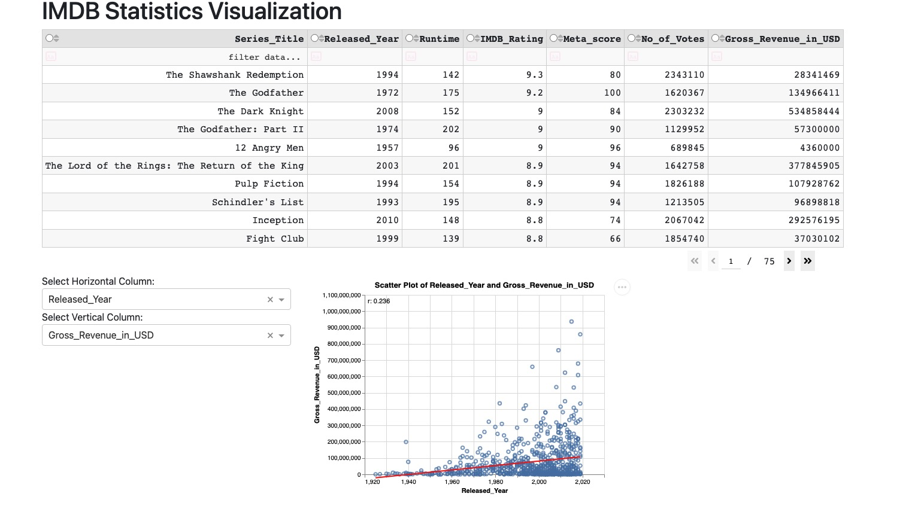

# IMDB_viz_python

Welcome everyone and thank you for visiting the `IMDB_viz_python` project repository!

If you love great movies and need some help figuring out which one to watch next, then you've come to the right place as our app is exactly what you need!

[Link to the IMDB_viz_python Dash App via Render](https://imdb-viz-python.onrender.com/)

To read more about our wonderful app, feel free to jump over to one of the sections below or continue scrolling down.

- [Motivation and Purpose](#motivation-and-purpose)
- [Usage](#usage)
- [Installation](#installation)
- [Contributing](#contributing)
- [Description of the data](#description-of-the-data)
- [License](#license)

## Motivation and Purpose

Choosing a good movie to watch can be a struggle sometimes and there's almost nothing worse than realizing you just spent 2 hours sitting through a horrible movie that you didn't enjoy one bit. Our user-friendly and accessible dashboard aims to help movie enthusiasts avoid this problem by helping them discover and explore new movies based on their movie watching preferences. In addition, our dashboard uses a vast database of movies to provide users with information on ratings, runtimes, and movie numbers presented through engaging visuals based on various metrics they can select via an interactive and intuitive interface. Please check out [Proposal](https://github.com/UBC-MDS/IMDB_Viz_R/blob/main/reports/proposal.md) and [shiny app](https://ykzhang1211.shinyapps.io/IMDB_Viz_R/) of our R version. This Python version is an addition to our R version where I primarily focus on the relationship among numeric columns. By analyzing and visualizing the correlation between different movie metrics, users can make more informed decisions about which movies to watch. Additionally, this approach allows for more sophisticated recommendations based on the user's preferences and movie history.

## Usage
Our dashboard offers a comprehensive view of the numerical data from the original IMDB dataset, allowing users to filter by and/or order by specific values. Additionally, our scatter plot feature allows users to select the X and Y axes to display the relationship between two variables visually. Each data point on the scatter plot represents a single movie, and hovering over it reveals more detailed information about that movie, such as its genre. To provide further insights, we've also included a fitted linear regression line on the scatter plot, accompanied by a text indicating the R^2 value of the two selected numerical columns. This feature enables users to analyze the relationship between two variables both analytically and visually, helping them to make more informed decisions when choosing a movie to watch.

## Installation

To start off, fork the repo from <https://github.com/louiewang820/IMDB_viz_python> and clone the forked repo to your local machine in [VScode](https://posit.co/download/rstudio-desktop/) by running:

`git clone https://github.com/[Your-GitHub-Page]/IMDB_viz_python.git`

Navigate to the folder and run the following in terminal to create and activate conda environment:

`conda env create --file environment.yaml`

`conda activate dataviz-532`

In the root directory of IMDB_viz_python folder, run `python src/app.py` to deploy the app locally.

## Contributing

Interested in contributing? Check out the [contributing guidelines](https://github.com/louiewang820/IMDB_viz_python/blob/main/CONTRIBUTING.md). Please note that this project is released with a [Code of Conduct](https://github.com/louiewang820/IMDB_viz_python/blob/main/CODE_OF_CONDUCT.md). By contributing to this project, you agree to abide by its terms.

## Description of the data

For the dashboard, we're sourcing the data from Kaggle, which is a well-known platform for data science and machine learning projects. It can be accessed [here](https://www.kaggle.com/datasets/harshitshankhdhar/imdb-dataset-of-top-1000-movies-and-tv-shows). The dataset contains 1000 observations of movie data with a compressive set of features. Some of the key features are the movie's title (Series_Title), the certificate issued (Certificate), release year (Released_Year), runtime (Runtime), genre (Genre), IMDB rating (IMDB_Rating), meta score (Meta_score), director (Director), star power (Star1, Star2, Star3, Star4), number of votes (No_of_votes), and box office earnings (Gross). The dataset also contains a summary of the movie (Overview) which allows the users to quickly understand if the story is something they would prefer or not. For this Python verson, I only extracted movies with no null values and selected title, genre and numerical columns. 

## License

`IMDB_viz_python` was created by Gaoxiang Wang. It is licensed under the terms of the MIT license.
